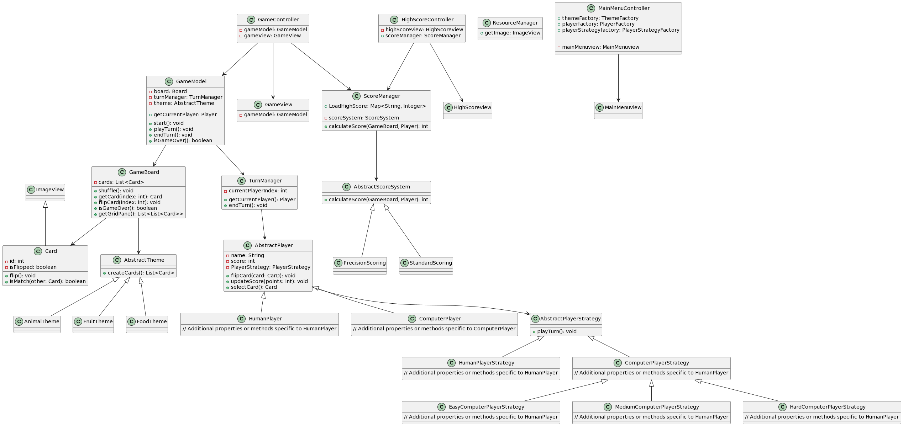

### Memory Game

I encountered several challenges while implementing the Memory Game due to time constraints and pressure, compounded by my limited experience in developing games in Java. Initially, I chose JavaFX as the framework for its graphical capabilities, but as I delved deeper into the project, I faced difficulties in achieving certain requirements.
One major obstacle was the inability to establish a game loop and manage UI updates effectively. JavaFX's event-driven nature posed a challenge as it dynamically handled UI updates, making it difficult to control the game's flow. Despite extensive research and efforts, I struggled to find a suitable solution within the framework's constraints.
Another challenge arose when implementing different card selection strategies for players. While I aimed to incorporate both manual selection (via clicking) and computer selection strategies, JavaFX's reliance on event listeners limited my options. As a result, I couldn't fulfill the requirements for state management and diverse selection strategies as initially envisioned.
Despite these setbacks, I persevered and made the best of the situation to ensure the game's functionality. While I couldn't meet all the requirements as intended, I focused on delivering a playable version within the given constraints. 

1. **Game Initialization and Configuration:**
   - The game initializes by generating random cards and constructing a game board, offering flexibility in the number of cards and difficulty levels.
   - Players can customize game settings through the menu, choosing parameters like the number of cards, player types, difficulty levels against the computer, and card themes (e.g., animal, food, fruit) generated by factories.
   - Implementation utilizes the Strategy design pattern, allowing seamless addition of new features.

2. **Responsive UI and Player Interaction:**
   - The UI provides a responsive and intuitive interface for players to interact with the game, including flipping cards and navigating controls (on;y in main, provided by JavaFX).
   - Dynamic updates to the UI reflect changes in game state and player interactions.

3. **Separation of Game State and UI:**
   - Challenges were encountered in separating game state from UI due to JavaFX's event-driven nature and navigation through stages and scenes.
   - Attempts to implement the state pattern were hindered by dynamic UI updates and reliance on event listeners.

4. **Flexible Card Matching Algorithm:**
   - Card matching decisions are based on a flexible algorithm supporting various modes.
   - Utilization of the Strategy design pattern and factories enables the generation of different card themes.

6. **Varied Difficulty Levels:**
   - Different levels of difficulty are provided, allowing players to adjust settings like the number of cards or types of matches required.
   - Difficulty levels against the computer are implemented using the Strategy design pattern and factories for dynamic gameplay experiences.

7. **Efficient Resource Management:**
   - Efficient management of memory and resources is ensured using Resource Manager, particularly when dealing with a large number of card objects and game assets.
   - The Image caching design pattern is utilized to handle images effectively.

8. **Scoring System and Player Feedback:**
   - The scoring system considers factors such as the number of flips, incorrect guesses.
   - Different game modes prioritize syuch as standard and precision, with final score display and displaying highscores in main.
   - Implementation of scoring strategies and a singleton Score Manager enhances modularity and maintainability.

9. **Extensibility for Future Features:**
   - The game architecture allows for the addition of new features such as game modes.
   - Design patterns like the Strategy pattern and factories facilitate the seamless integration of new functionalities, ensuring the game remains engaging and dynamic.

### UML

